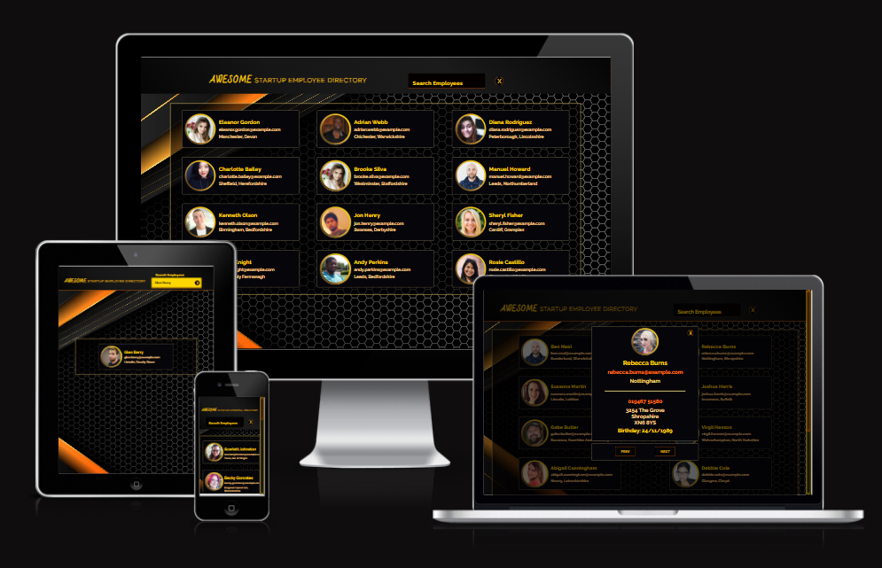
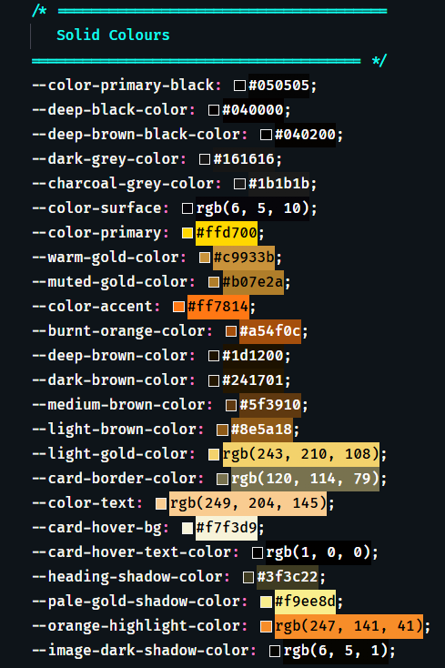
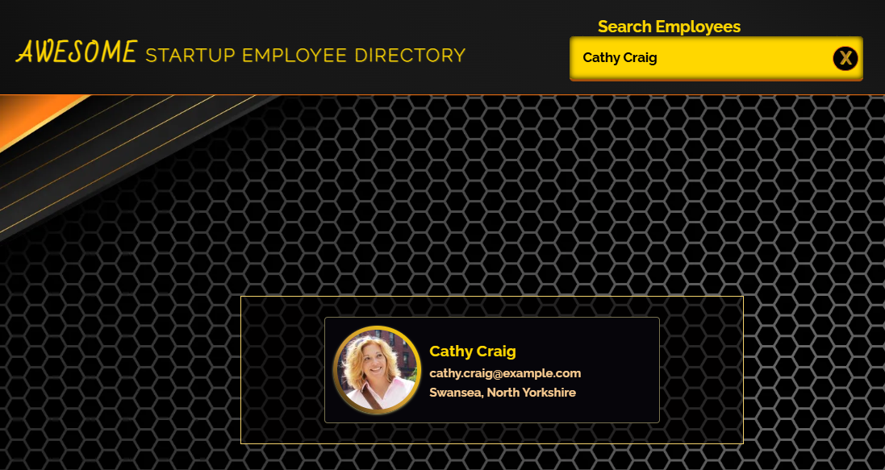
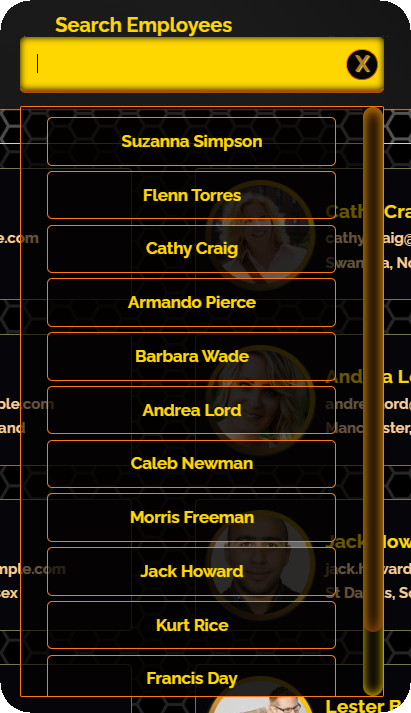
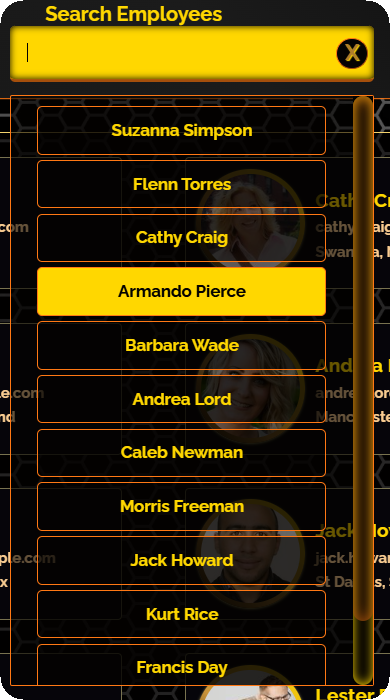
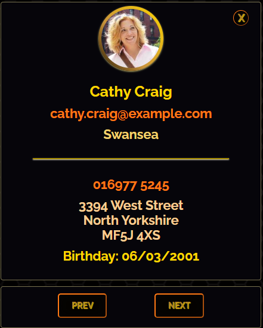
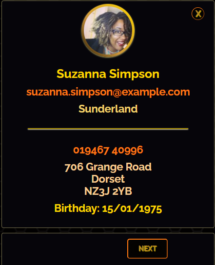
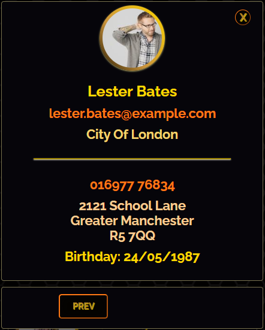

# Awesome Employees

## 📚 Table of Contents

- [🔗 Project Overview](#-project-overview)
- [✨ Features](#-features)
  - [🎨 Custom Theme](#-custom-theme)
  - [🔍 Search & Filtering](#-search--filtering)
  - [👥 Employee Gallery](#-employee-gallery)
  - [🪟 Employee Modal & Overlay](#-employee-modal--overlay)
  - [⬅️➡️ Modal Navigation](#️-modal-navigation)
- [🛠️ Technologies Used](#️-technologies-used)
- [🐞 Bugs & Fixes](#-bugs--fixes)
- [🧪 Testing](#-testing)
- [🚀 Installation](#-installation)



A responsive employee directory built with **HTML**, **CSS**, and **vanilla JavaScript** that retrieves live employee data from the Random User API.

The application displays employee profiles in an interactive gallery, supports real-time searching and filtering, and provides a fully featured modal interface with previous/next navigation.

---

## 🔗 Project Overview

This project consumes data from the **Random User API** to generate a responsive employee directory entirely on the client side. Employee cards are created dynamically from a single API request, with additional functionality including live search, modal navigation, and a custom visual theme.

The project was developed as part of the Treehouse Full Stack JavaScript Techdegree and was extended beyond the core requirements by implementing the optional **Exceeds Expectations** features, including employee search, modal navigation, and a complete visual redesign.

### 🌐 Live Demo

[Awesome Employee Startup - Live](https://samatkinsonmodeste.github.io/fsjs-project-5-api-awesome-employees/)

### 📂 Repository

[GitHub Repository - Project 5: API](https://samatkinsonmodeste.github.io/fsjs-project-5-api-awesome-employees/)

[⬆️ Back to Top](#awesome-employees)

---

## ✨ Features

### 🎨 Custom Theme

The original Treehouse project was redesigned with a custom visual identity while preserving the required layout and functionality. The interface uses a warm colour palette, custom typography, responsive refinements, and updated interactive elements to create a more polished user experience. These style customisations also satisfy the project's "Make It Your Own" requirements. :contentReference[oaicite:0]{index=0}

#### Colour Palette



A custom palette of warm browns, golds, and neutral tones was chosen to give the application a distinctive appearance while maintaining good readability and contrast.

#### Typography

**Bad Script**


Used exclusively for the word **"AWESOME"** in the main page heading to create a welcoming focal point and establish the application's visual identity.

**Raleway Dots**


Used for the **"STARTUP EMPLOYEE DIRECTORY"** portion of the main heading, complementing the handwritten style of **Bad Script** while giving the title a distinctive, playful appearance.

**Raleway**

The remainder of the application uses **Raleway**, providing a clean, modern sans-serif typeface that maintains excellent readability throughout the employee directory.

#### Additional Style Enhancements

- Custom full-page background image
- Custom gradient header
- Redesigned employee cards
- Custom search interface and dropdown styling
- Updated modal and overlay styling
- Responsive layout refinements
- Improved hover and focus states
- Smooth CSS transitions throughout the interface

[⬆️ Back to Top](#awesome-employees)

---

### 🔍 Search & Filtering

The employee directory includes a custom search interface that filters the employees already loaded from the API. Results update in real time as the user types, without making any additional API requests.


#### Real-Time Employee Filtering

The search input performs a case-insensitive comparison against each employee's full name. As the search value changes, matching employee cards remain visible while non-matching cards are hidden.

The gallery layout also adapts when fewer results are displayed, preventing a single matching employee from stretching across the full page.



#### Custom Name Suggestions

A custom-styled suggestion list is generated from the names of the employees returned by the API.



Matching options are highlighted as the user types, making it easier to identify and select an employee from the available results.



Selecting a name from the list:

- Adds the employee's full name to the search input
- Filters the gallery to the selected employee
- Closes the suggestion list
- Updates the search label and input styling

#### Search Reset

A custom clear button resets the search input, restores all employee cards, closes the suggestion list, and returns the gallery to its default layout.

The search interface supports:

- Full or partial employee names
- First-name and last-name searches
- Case-insensitive matching
- Live filtering while typing
- Clickable employee suggestions
- Automatic handling of a single remaining result
- Resetting the complete employee directory

[⬆️ Back to Top](#awesome-employees)

---

### 👥 Employee Gallery

Employee information is retrieved from the **Random User API** using a single request when the application loads. Each employee is dynamically rendered as an interactive card, ensuring a new set of employee profiles is displayed every time the page is refreshed.


Each employee card displays key information at a glance, including:

- Profile photograph
- Full name
- Email address
- City and County (State)

The gallery has been designed to provide a clean, responsive layout that adapts across desktop, tablet, and mobile screen sizes. Interactive hover effects and subtle transitions provide clear visual feedback, making it obvious that each card can be selected to view additional employee details.

Clicking anywhere on an employee card opens a detailed modal containing the employee's full profile.

[⬆️ Back to Top](#awesome-employees)

---

### 🪟 Employee Modal & Overlay

Selecting an employee card opens a full-screen overlay containing a detailed employee profile, allowing users to view additional information without leaving the employee directory.



Each modal presents a complete employee profile, including:

- Larger profile photograph
- Full name
- Email address
- Location
- Mobile phone number
- Full postal address
- Date of birth

The modal is dynamically generated using the employee data retrieved from the API and is recreated each time a different employee is selected, ensuring the displayed information always reflects the active employee.

The overlay helps keep the user's focus on the selected profile while subtly dimming the employee gallery in the background. A dedicated close button allows the modal to be dismissed at any time, returning the user to the employee directory.

[⬆️ Back to Top](#awesome-employees)

---

### ⬅️➡️ Modal Navigation

To improve the browsing experience, the employee modal includes **Previous** and **Next** navigation buttons, allowing users to move seamlessly through the employee directory without returning to the gallery.



When viewing the first employee, the **Previous** button is automatically hidden, clearly indicating that no earlier employee is available.



Likewise, when viewing the last employee, the **Next** button is hidden to prevent navigation beyond the available employee list.

For all other employees, both navigation buttons remain visible, allowing users to browse the directory one employee at a time while remaining within the modal.

The navigation logic includes boundary checks to ensure users cannot navigate past the beginning or end of the employee list, providing a smooth browsing experience without generating console errors.

[⬆️ Back to Top](#awesome-employees)

---

## 🛠️ Technologies Used

| Technology                    | Purpose                                                             |
| ----------------------------- | ------------------------------------------------------------------- |
| **HTML5**                     | Semantic structure and application markup                           |
| **CSS3**                      | Custom styling, responsive layout, animations, and transitions      |
| **JavaScript (ES6+)**         | Dynamic UI, DOM manipulation, event handling, and application logic |
| **Random User Generator API** | Provides live employee profile data                                 |
| **Adobe Fonts**               | Custom typography using Bad Script, Raleway Dots, and Raleway       |
| **Git**                       | Version control throughout development                              |
| **GitHub**                    | Source code hosting and project repository                          |
| **GitHub Pages**              | Live project deployment                                             |

[⬆️ Back to Top](#awesome-employees)

---

## 🐞 Bugs & Fixes

Throughout development, several implementation issues were identified during testing and resolved by refining the application's DOM manipulation, CSS architecture, and search functionality.

### Bug 1 — Modal Navigation Container Position

**Problem**

After navigating between employees using the **Previous** and **Next** buttons, the navigation button container gradually moved above the employee modal.

**Cause**

The employee modal was being inserted after the navigation container each time it was recreated, causing the DOM order to change.

**Solution**

The modal insertion point was changed to use `insertAdjacentHTML("afterbegin")`, ensuring the modal is always inserted before the navigation controls while allowing only the modal content to be recreated during navigation.

---

### Bug 2 — Rapid Navigation at the Beginning and End of the Employee List

**Problem**

Rapidly clicking the **Previous** or **Next** buttons when viewing the first or last employee could remove the current modal before attempting to navigate beyond the available employee list.

**Cause**

The modal was being removed before confirming that a valid previous or next employee existed.

**Solution**

Boundary checks were added before updating the active employee index. This prevents invalid navigation attempts, keeps the current modal visible, and eliminates console errors when the beginning or end of the employee list is reached. :contentReference[oaicite:0]{index=0}

---

### Bug 3 — Search Suggestions Could Not Be Reliably Hidden

**Problem**

The custom employee suggestion list remained visible or reappeared unexpectedly because its visibility was controlled by the input element's `:focus` and `:active` states.

**Cause**

A CSS sibling selector automatically displayed the datalist whenever the search input received focus, preventing JavaScript from fully controlling when the suggestion list should open or close.

**Solution**

The focus-based sibling selector was removed, and visibility was managed entirely through JavaScript by adding and removing dedicated CSS classes. This provided complete control over when the suggestion list was displayed.

---

### Bug 4 — Adding the `show` Class Did Not Display the Datalist

**Problem**

After switching to JavaScript-controlled visibility, adding the `show` class to the custom datalist had no visible effect.

**Cause**

The generic `.show` class did not override the datalist's existing `display: none` styling because the selector lacked sufficient specificity.

**Solution**

A dedicated CSS selector (`#data-names.show`) was created to explicitly display the datalist whenever the `show` class was applied. This allowed JavaScript to reliably control the component's visibility.

---

### Bug 5 — Employee Cards Were Matched by DOM Position Instead of Employee Index

**Problem**

During filtering, employee cards were initially associated with search results using their position within the DOM, making the implementation fragile.

**Cause**

The filtering logic relied on the order of DOM elements rather than explicitly identifying each employee card.

**Solution**

Each employee card was linked to its corresponding employee using a `data-index` attribute. The filtering logic then selected cards using their unique index, creating a more robust relationship between the employee data, search suggestions, and gallery cards.

[⬆️ Back to Top](#awesome-employees)

---

## 🧪 Testing

The application was tested throughout development using Chrome DevTools and manual functional testing to ensure each feature behaved as expected across different application states.

### Development Testing

- Used `console.log()` statements to inspect variables and verify application state during development.
- Used `setTimeout()` while testing asynchronous API requests to confirm employee data had been retrieved before interacting with the application.
- Used the Chrome DevTools Console to identify and resolve JavaScript errors.
- Used the Elements panel to inspect dynamically generated HTML and verify DOM updates.
- Used the Network panel to confirm successful API requests and responses.

### Functional Testing

The following functionality was tested throughout development:

- Loading employee data from the Random User API
- Rendering all employee cards
- Opening and closing the employee modal
- Previous and Next modal navigation
- Navigation boundary conditions
- Live employee search
- Partial and case-insensitive searches
- Selecting employee names from the custom suggestion list
- Clearing search results
- Responsive layouts across different screen sizes
- Hover, focus, and transition effects
- Browser console checked throughout testing to ensure no JavaScript errors remained

[⬆️ Back to Top](#awesome-employees)

---

## 🚀 Installation

To run this project locally:

1. Clone the repository.

```bash
git clone https://github.com/YOUR-USERNAME/fsjs-project-5-public-api-requests.git
```

2. Navigate to the project directory.

```bash
cd fsjs-project-5-public-api-requests
```

3. Open the project in your preferred code editor.

4. Launch `index.html` using a local development server (such as the VS Code **Live Server** extension) or open it directly in your browser.

No additional dependencies or build tools are required.

[⬆️ Back to Top](#awesome-employees)

---
